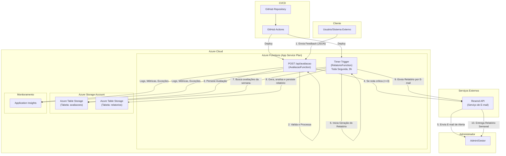

```mermaid
graph TD
    subgraph "Cliente"
        User[Usuário/Sistema Externo]
    end

    subgraph "Azure Cloud"
        subgraph "Azure Functions (App Service Plan)"
            direction LR
            HttpTrigger["POST /api/avaliacao<br>(AvaliacaoFunction)"]
            TimerTrigger["Timer Trigger<br>(RelatorioFunction)<br>Toda Segunda, 9h"]
        end

        subgraph "Azure Storage Account"
            direction TB
            TableAvaliacoes["Azure Table Storage<br>(Tabela: avaliacoes)"]
            TableRelatorios["Azure Table Storage<br>(Tabela: relatorios)"]
        end

        subgraph "Monitoramento"
            AppInsights[Application Insights]
        end
    end

    subgraph "Serviços Externos"
        Resend["Resend API<br>(Serviço de E-mail)"]
    end

    subgraph "Administrador"
        Admin[Admin/Gestor]
    end

    subgraph "CI/CD"
        GitHub[GitHub Repository]
        GitHubActions[GitHub Actions]
    end

    GitHub --> GitHubActions
    GitHubActions --"Deploy"--> HttpTrigger
    GitHubActions --"Deploy"--> TimerTrigger

    User --"1. Envia Feedback (JSON)"--> HttpTrigger
    HttpTrigger --"2. Valida e Processa"--> HttpTrigger
    HttpTrigger --"3. Persiste Avaliação"--> TableAvaliacoes
    HttpTrigger --"4. Se nota crítica (<=3)"--> Resend
    Resend --"5. Envia E-mail de Alerta"--> Admin

    TimerTrigger --"6. Inicia Geração do Relatório"--> TimerTrigger
    TimerTrigger --"7. Busca avaliações da semana"--> TableAvaliacoes
    TimerTrigger --"8. Gera, analisa e persiste relatório"--> TableRelatorios
    TimerTrigger --"9. Envia Relatório por E-mail"--> Resend
    Resend --"10. Entrega Relatório Semanal"--> Admin

    HttpTrigger --"Logs, Métricas, Exceções"--> AppInsights
    TimerTrigger --"Logs, Métricas, Exceções"--> AppInsights
```